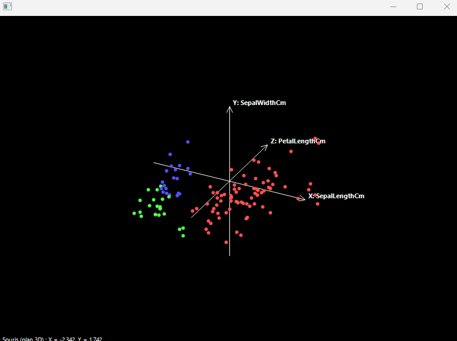
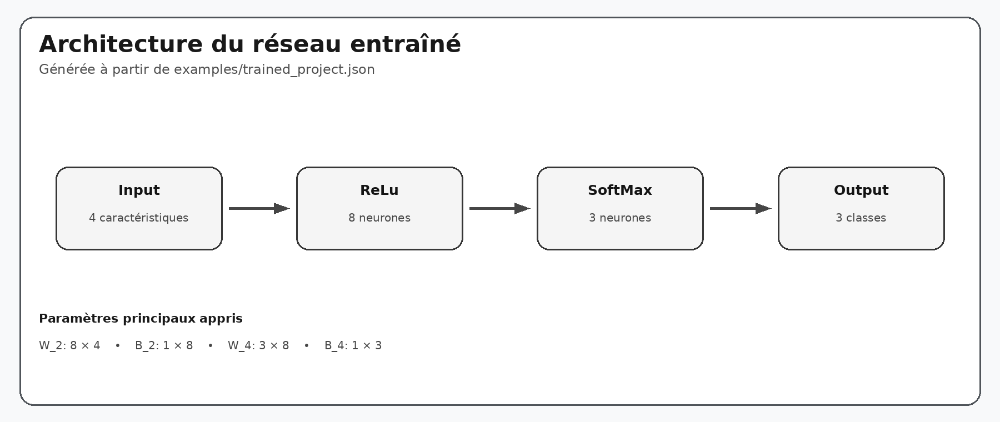
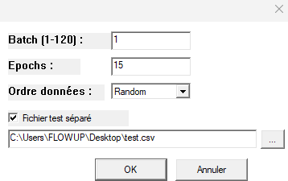
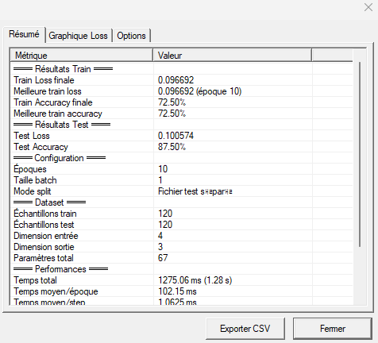
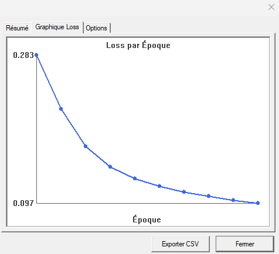
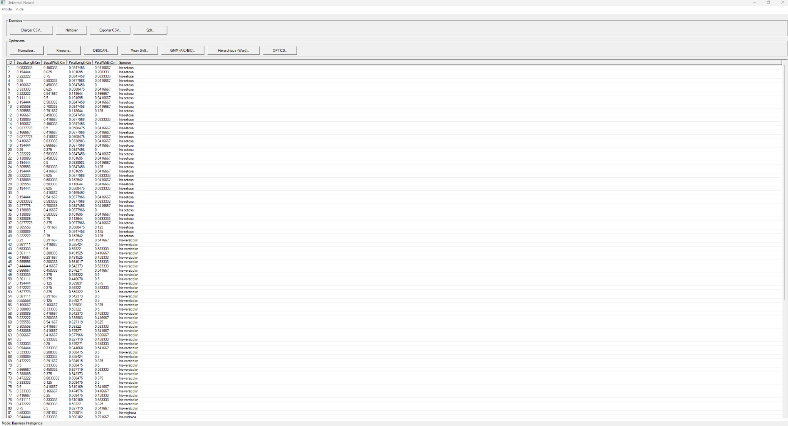
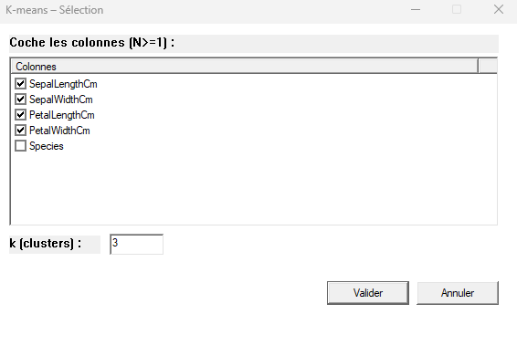
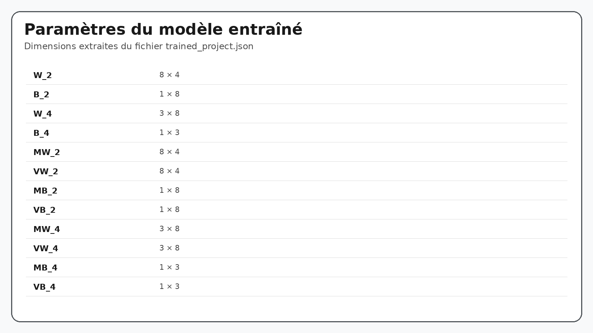

# Neural Network & Data Analysis — C++ / CUDA

Projet C++ orienté calcul scientifique et intelligence artificielle, comprenant un moteur de tenseurs et d'expressions, une représentation de graphe de réseau neuronal, un éditeur graphique Win32, un entraînement GPU CUDA et un module d'analyse/clustering de données.

> **Rendu GitHub :** les formules utilisent la syntaxe de bloc ` ```math ` recommandée par GitHub. GitHub prend en charge les expressions mathématiques LaTeX dans les fichiers Markdown et les rend avec MathJax.

---

## 1. Vue d'ensemble

Le projet est organisé autour de plusieurs couches :

- **moteur de tenseurs et d'expressions** : `TENSOR` et `EXP` ;
- **construction du réseau** : graphe de nœuds et d'arêtes décrit par `nn::Project` ;
- **couches neuronales** : Dense, convolution, RNN, LSTM, GRU, Attention, normalisation, pooling, etc. ;
- **propagation** : `ForwardGraph()` et `BackwardGraph()` ;
- **optimisation** : Adam avec moments du premier et du second ordre ;
- **exécution GPU** : CUDA + cuBLAS, avec allocation persistante des paramètres et réutilisation des intermédiaires ;
- **IHM Windows** : éditeur de réseau et outils d'analyse de données ;
- **persistance** : projets et réseaux entraînés sérialisés en JSON.


---

## Démonstration visuelle

Le projet dispose de deux grandes interfaces : l'analyse de données et l'éditeur de réseaux neuronaux.

### Analyse 3D des données

<p align="center">
  
</p>

La vue 3D permet d'inspecter les observations après sélection des variables et d'observer les groupes dans l'espace des caractéristiques.

### Architecture du réseau entraîné

<p align="center">
  
</p>

Cette représentation est générée directement à partir du fichier [`examples/trained_project.json`](examples/trained_project.json), plutôt que d'utiliser une capture d'écran de l'éditeur.

Le réseau sauvegardé correspond à la chaîne :

```text
Input (4 caractéristiques)
   ↓
ReLU (8 neurones)
   ↓
SoftMax (3 classes)
   ↓
Output
```

Les poids sauvegardés ont notamment les dimensions `W_2 : 8 × 4` et `W_4 : 3 × 8`.

### Configuration d'un entraînement

<p align="center">
  
</p>

Les paramètres de l'entraînement comprennent notamment la taille du batch, le nombre d'époques, le mode de séparation des données et un éventuel fichier de test séparé.

---

## 2. Architecture

```text
+---------------------------+
|        IHM Win32          |
|  SimpleApp / NNEditor     |
+-------------+-------------+
              |
              v
+---------------------------+
|       nn::Project         |
| Nodes + Edges + config    |
+-------------+-------------+
              |
              v
+---------------------------+
|     Network / Neurons     |
| Forward + Backward graph  |
+-------------+-------------+
              |
              v
+---------------------------+
|      TENSOR / EXP         |
| Graph of symbolic ops     |
+-------------+-------------+
              |
              v
+---------------------------+
|   GpuTrainRuntime (CUDA)  |
| CUDA + cuBLAS + buffers   |
+---------------------------+
```

---

## 3. Arborescence

```text
projet/
├── IHM/
│   ├── include/
│   │   ├── NNEditor.h
│   │   └── SimpleApp.h
│   └── src/
│       ├── NNEditor.cpp
│       └── SimpleApp.cpp
│
├── include/
│   ├── constante.h
│   ├── math2.h
│   ├── networks.h
│   ├── neuron.h
│   ├── tensor.h
│   ├── util.h
│   ├── train_gpu.h
│   ├── gpu_train_runtime.h
│   ├── nn_project.h
│   ├── nn_project_builder.h
│   ├── nn_project_json.h
│   ├── nn_project_trained_json.h
│   └── core/
│       ├── DatasetSchema.h
│       ├── Project.h
│       └── TaskType.h
│
├── src/
│   ├── main.cpp
│   ├── tensor.cpp
│   ├── math2.cpp
│   ├── neuron.cpp
│   ├── networks.cpp
│   ├── train_gpu.cpp
│   ├── gpu_train_runtime.cu
│   ├── util.cpp
│   ├── constante.cpp
│   ├── nn_project_trained_json.cpp
│   ├── core/
│   │   └── TaskInference.cpp
│   ├── test/
│   │   ├── operation_test.cpp
│   │   ├── tensor_test.cpp
│   │   └── test.cpp
│   └── ui/
│       └── PanelDataset.cpp
│
└── mak.mak
```

---

## Exemple concret : modèle entraîné

Le fichier `examples/trained_project.json` décrit le réseau utilisé pour la démonstration Iris. Les quatre colonnes d'entrée sont les quatre mesures classiques du jeu de données, et les trois sorties correspondent aux classes `Iris-setosa`, `Iris-versicolor` et `Iris-virginica`.

La structure du graphe sérialisé est :

```text
Input → ReLu → SoftMax → Output
```

Les dimensions des principaux poids sauvegardés sont :

```math
W_2\in\mathbb{R}^{8\times4}
```

et :

```math
W_4\in\mathbb{R}^{3\times8}
```


## 4. Représentation d'un réseau

Le projet décrit un réseau par :

- des **nœuds** (`Input`, `Hidden`, `Output`) ;
- des **arêtes orientées** ;
- les paramètres de chaque nœud ;
- la fonction d'activation ;
- le type de couche ;
- la fonction de perte ;
- la taille de batch ;
- le mode de séparation du dataset.

### Types de nœuds

```text
Input
Hidden
Output
```

### Initialisation des poids

Le runtime prend en charge :

```text
Zero
RandomUniform
RandomNormal
Xavier
He
```

Pour une matrice de poids de taille `fan_out × fan_in`, l'initialisation Xavier uniforme est :

```math
W_{ij}\sim\mathrm{Uniform}(-a,a)
```

avec :

```math
a=\sqrt{\frac{6}{fan_{in}+fan_{out}}}
```

L'initialisation de He est gaussienne :

```math
W_{ij}\sim\mathrm{Normal}(0,\sigma^2)
```

avec :

```math
\sigma=\sqrt{\frac{2}{fan_{in}}}
```

---

# 5. Tenseur et graphe d'expressions

Le moteur distingue deux objets principaux.

### `TENSOR`

Un tenseur possède notamment :

- son nom ;
- sa dimension ;
- ses données hôte ;
- éventuellement un stockage GPU ;
- son réseau propriétaire.

Le moteur expose des opérations comme :

```text
+
-
*
/
sqrt
ABS
Log
Sign
Cosh
Clamp
Max
Min
Square
Mean
Var
Sum
Reshape
Gather
CONCAT
SLICE_LAST
Conv2D
MaxPool2D
AvgPool2D
Softmax
```

### `EXP`

`EXP` représente une expression symbolique et référence les opérations du graphe.

Une chaîne de calcul peut par exemple être :

```text
X
 ↓
X × Wᵀ
 ↓
X × Wᵀ + B
 ↓
f(...)
```

La trace d'opérations peut ensuite être interprétée par le runtime GPU.

---

# 6. Couche Dense

Pour une entrée `X`, une matrice de poids `W` et un biais `B`, le forward implémenté par `Perceptron` est :

```math
Z=XW^\mathrm{T}+B
```

Puis :

```math
A=f(Z)
```

Pour le backward :

```math
G_Z=G_A\odot f'(Z)
```

Le gradient des poids est :

```math
G_W=G_Z^\mathrm{T}X
```

Le gradient des biais est réduit sur le batch :

```math
G_B=\sum_i G_{Z,i}
```

et le gradient envoyé à la couche précédente est :

```math
G_X=G_ZW
```

---

# 7. Fonctions d'activation

Les activations définies dans `math2.h` sont :

```text
BinaryStep
Sigmoid
Tanh
ReLU
LeakyReLU
Swish
Softplus
Softsign
Softmax
None
```

## 7.1 Binary Step

Le code utilise une approximation lisse :

```math
f(x)=\frac{1}{1+e^{-100x}}
```

Le gradient utilisé est une approximation straight-through :

```math
f'(x)=100s(x)(1-s(x))
```

avec :

```math
s(x)=\frac{1}{1+e^{-100x}}
```

## 7.2 Sigmoid

```math
f(x)=\frac{1}{1+e^{-x}}
```

et :

```math
f'(x)=f(x)(1-f(x))
```

## 7.3 Tanh

```math
f(x)=\tanh(x)
```

et :

```math
f'(x)=1-f(x)^2
```

## 7.4 ReLU

```math
f(x)=\max(0,x)
```

## 7.5 Leaky ReLU

Le projet fixe `\alpha=0.01` :

```math
f(x)=0.01x+0.99\max(0,x)
```

et sa dérivée :

```math
f'(x)=
\begin{cases}
0.01 & \text{si }x<0\\
1 & \text{si }x\geq0
\end{cases}
```

## 7.6 Swish

```math
f(x)=x\,\sigma(x)
```

avec :

```math
\sigma(x)=\frac{1}{1+e^{-x}}
```

La dérivée utilisée par le code est :

```math
f'(x)=f(x)+\sigma(x)(1-f(x))
```

## 7.7 Softplus

```math
f(x)=\ln(1+e^x)
```

et :

```math
f'(x)=\sigma(x)
```

## 7.8 Softsign

```math
f(x)=\frac{x}{1+|x|}
```

et :

```math
f'(x)=\frac{1}{(1+|x|)^2}
```

## 7.9 Softmax

Le softmax standard est :

```math
\mathrm{softmax}(z_i)=\frac{e^{z_i}}{\sum_j e^{z_j}}
```

Le projet possède une opération `softmax` dédiée.

---

# 8. Fonctions de perte

Les losses disponibles sont :

```text
MSE
MAE
CrossEntropy
BinaryCrossEntropy
CategoricalCrossEntropy
Hinge
Huber
KLDivergence
CosineSimilarity
LogCosh
None
```

## 8.1 MSE

Le code utilise une factorisation `1/2` :

```math
L=\frac{1}{2m}\sum_i(\hat y_i-y_i)^2
```

Gradient utilisé :

```math
\frac{\partial L}{\partial\hat y}
=
\frac{1}{m}(\hat y-y)
```

## 8.2 MAE

```math
L=\frac{1}{m}\sum_i|\hat y_i-y_i|
```

Le gradient utilise l'opération signe :

```math
\frac{\partial L}{\partial\hat y}
=
\frac{1}{m}\mathrm{sign}(\hat y-y)
```

## 8.3 Cross-Entropy

```math
L=-\frac{1}{m}\sum_i y_i\ln(\hat y_i)
```

Le code applique un clamp avant le logarithme :

```math
\hat y_c=
\mathrm{clamp}(\hat y,\varepsilon,1-\varepsilon)
```

## 8.4 Binary Cross-Entropy

```math
L=
-\frac{1}{m}
\sum_i
[
y_i\ln(\hat y_i)
+
(1-y_i)\ln(1-\hat y_i)
]
```

## 8.5 Hinge

```math
L=
\frac{1}{m}
\sum_i
\max(0,1-y_i\hat y_i)
```

avec des labels de type `-1` / `+1`.

## 8.6 Huber lissée

L'implémentation utilise :

```math
L=
\frac{1}{m}
(
\sqrt{(\hat y-y)^2+\delta^2}-\delta
)
```

avec `\delta=1`.

## 8.7 KL Divergence

La forme utilisée est :

```math
D_{KL}(P\parallel Q)
=
\sum_i
P_i
(
\ln P_i-\ln Q_i
)
```

Les valeurs utilisées dans les logarithmes sont clampées pour la stabilité numérique.

## 8.8 Similarité cosinus

```math
\cos(\theta)
=
\frac{x\cdot y}{\|x\|\|y\|}
```

et :

```math
L=1-\cos(\theta)
```

## 8.9 Log-Cosh

```math
L=
\frac{1}{m}
\sum_i
\ln(\cosh(\hat y_i-y_i))
```

---

# 9. Optimisation Adam

Le projet maintient quatre états pour Adam :

```text
MW
VW
MB
VB
```

Les moments sont mis à jour avec :

```math
M_t=\beta_1M_{t-1}+(1-\beta_1)G_t
```

et :

```math
V_t=\beta_2V_{t-1}+(1-\beta_2)G_t^2
```

Correction du biais :

```math
\hat M_t=\frac{M_t}{1-\beta_1^t}
```

```math
\hat V_t=\frac{V_t}{1-\beta_2^t}
```

Mise à jour utilisée par le projet :

```math
W_t=
W_{t-1}
-
\alpha
(
\frac{\hat M_t}{\sqrt{\hat V_t}+\varepsilon}
+
\lambda W_{t-1}
)
```

Le même principe est appliqué aux biais.

Le code définit :

```math
\varepsilon=10^{-3}
```

pour la stabilité numérique.

---


### Résultats d'entraînement

Un entraînement sur le jeu de données présenté dans l'interface produit un résumé des métriques et une courbe de loss par époque.

<p align="center">
  
</p>

<p align="center">
  
</p>

# 10. Couches disponibles

L'éditeur expose :

```text
Dense
Conv1D
Conv2D
Conv3D
RNN
LSTM
GRU
Attention
Embedding
Dropout
BatchNorm
LayerNorm
Pooling
Flatten
Residual
```

ainsi que :

```text
Input
Output
```

## Dropout

En mode entraînement, le principe d'inverted dropout est :

```math
\tilde x=\frac{m\odot x}{1-p}
```

où `m` représente le masque et `p` le taux de dropout.

## Batch Normalization

La normalisation s'écrit :

```math
\hat x=
\frac{x-\mu}{\sqrt{\sigma^2+\varepsilon}}
```

puis :

```math
y=\gamma\hat x+\beta
```

## Layer Normalization

La forme est également :

```math
\hat x=
\frac{x-\mu}{\sqrt{\sigma^2+\varepsilon}}
```

puis :

```math
y=\gamma\hat x+\beta
```

La différence avec BatchNorm concerne les axes de réduction.

## Convolution 2D

Le moteur expose :

```text
Conv2D(input, kernel, stride, padding)
```

Une forme discrète simplifiée est :

```math
Y(i,j)=\sum_u\sum_v X(i+u,j+v)K(u,v)
```

## Pooling

Max-pooling :

```math
y=\max_{x\in R}x
```

Average-pooling :

```math
y=\frac{1}{|R|}\sum_{x\in R}x
```

## Attention

La couche `Attention` utilise la formulation :

```math
\mathrm{Attention}(Q,K,V)
=
\mathrm{softmax}
(
\frac{QK^\mathrm{T}}{\sqrt{d_k}}
)V
```

## Residual

Le principe d'une connexion résiduelle est :

```math
y=F(x)+x
```

Le backward transmet donc le gradient par les chemins direct et transformé.

---

# 11. Construction du graphe

Le graphe est défini par deux structures principales :

```text
Node:
    id
    name
    kind
    size
    layerType
    activation
    weightInit
    inputFile
    inputColumns
    outputFile
    outputColumns

Edge:
    fromId
    toId
```

Lorsqu'un nœud possède plusieurs parents, `CreateNetworkGraph()` peut insérer un nœud de fusion interne afin de ramener ces dépendances à une structure compatible avec le plan d'exécution.

---

# 12. Forward / Backward

### Forward

Pour une couche Dense :

```math
Z=XW^\mathrm{T}+B
```

puis :

```math
A=f(Z)
```

### Backward

Le gradient est propagé de la sortie vers les parents :

```math
G_Z=G_A\odot f'(Z)
```

```math
G_W=G_Z^\mathrm{T}X
```

```math
G_B=\sum_iG_{Z,i}
```

```math
G_X=G_ZW
```

La méthode `BackwardGraph()` orchestre cette propagation dans le graphe.

---

# 13. Runtime GPU

`GpuTrainRuntime` exécute la trace d'opérations sur le GPU.

Deux catégories de buffers sont utilisées.

### Tenseurs persistants

Exemples :

```text
W_*
B_*
MW_*
VW_*
MB_*
VB_*
INPUT_*
LABEL_*
```

### Tenseurs intermédiaires

Les résultats temporaires sont référencés par identifiant :

```text
{id}
```

Les buffers peuvent être réutilisés entre les opérations.

---

# 14. CUDA et cuBLAS

Le runtime utilise notamment :

```text
CUDA Runtime
cuBLAS
cudaStream_t
cublasHandle_t
```

Flux général :

```text
Batch CPU
   ↓
CopyH2D
   ↓
Trace GPU
   ↓
Forward
   ↓
Backward
   ↓
Adam
   ↓
CopyD2H
```

---

# 15. Chargement CSV

Le lecteur CSV du runtime :

- détecte un éventuel en-tête ;
- crée des noms `c0`, `c1`, etc. lorsqu'il n'en trouve pas ;
- convertit les valeurs numériques en `float` ;
- représente les valeurs non numériques par `NaN` ;
- vérifie la cohérence du nombre de colonnes.

Les colonnes d'entrée et de sortie sont ensuite sélectionnées dans le projet.

---

# 16. Séparation des données

Le projet prévoit les modes :

```text
Random
Stratified
Chronological
```

Le mode chronologique est prévu pour les séries temporelles.

---

# 17. Normalisation

L'interface propose quatre transformations.

### Min-Max

```math
x'=\frac{x-x_{\min}}{x_{\max}-x_{\min}}
```

### Z-Score

```math
x'=\frac{x-\mu}{\sigma}
```

### Centrage

```math
x'=x-\mu
```

### L2 par colonne

```math
x'=\frac{x}{\sqrt{\sum_i x_i^2}}
```

---

# 18. Analyse et clustering

Le mode analyse de `SimpleApp` propose notamment :

```text
K-means
DBSCAN
Mean Shift
GMM
Hiérarchique — Ward
OPTICS
```

Les données sélectionnées peuvent être affichées dans une vue 3D même lorsque l'espace d'origine est de dimension supérieure.


### Captures de l'interface d'analyse

Le tableau des données permet de sélectionner les colonnes numériques utilisées par les algorithmes de clustering.

<p align="center">
  
</p>

La boîte de dialogue K-means permet de sélectionner les variables et de définir le nombre de clusters.

<p align="center">
  
</p>

## 18.1 K-means

Le critère classique est :

```math
J=
\sum_{i=1}^{N}
\|x_i-c_{y_i}\|^2
```

Le centroïde est recalculé avec :

```math
c_k=
\frac{1}{|C_k|}
\sum_{x_i\in C_k}x_i
```

## 18.2 DBSCAN

La distance utilisée est euclidienne :

```math
d(x,y)=\sqrt{\sum_{j=1}^{D}(x_j-y_j)^2}
```

Le voisinage est :

```math
N_{\varepsilon}(x)
=
\{
y\mid d(x,y)\leq\varepsilon
\}
```

## 18.3 Mean Shift

Le poids utilisé par le noyau gaussien est :

```math
w_i=
\exp
(
-\frac{\|x-x_i\|^2}{2h^2}
)
```

Le nouveau mode est :

```math
m(x)=
\frac{\sum_i w_i x_i}
{\sum_i w_i}
```

Les modes suffisamment proches sont ensuite fusionnés.

## 18.4 GMM

Le module utilise un algorithme EM avec des composantes gaussiennes.

La responsabilité du composant `k` est :

```math
r_{ik}
=
\frac{
\pi_k\mathcal{N}(x_i\mid\mu_k,\Sigma_k)
}{
\sum_j
\pi_j\mathcal{N}(x_i\mid\mu_j,\Sigma_j)
}
```

Une régularisation diagonale de la covariance est appliquée :

```math
\Sigma_karrow\Sigma_k+\lambda I
```

avec :

```math
\lambda=10^{-6}
```

## 18.5 Ward

La distance utilisée dans l'implémentation est :

```math
D(A,B)
=
\frac{|A||B|}{|A|+|B|}
\|\mu_A-\mu_B\|^2
```

Les deux clusters donnant la plus petite valeur sont fusionnés jusqu'à atteindre le nombre demandé.

## 18.6 OPTICS

L'implémentation calcule :

```text
Voisinages
Core-distance
Reachability-distance
Ordre de visite
```

La reachability-distance utilise :

```math
reach(p)=
\max
(
coreDist(q),
d(q,p)
)
```

Une file de priorité est utilisée pour sélectionner les prochains points à visiter.

---

# 19. IHM

## Mode analyse

```text
Chargement CSV
Sélection des colonnes
Normalisation
K-means
DBSCAN
Mean Shift
GMM
Clustering hiérarchique
OPTICS
Vue ND → 3D
Export
```

## Mode réseau neuronal

`NNEditor` permet :

```text
Ajouter / supprimer des nœuds
Créer / supprimer des arêtes
Configurer Input / Output
Choisir la couche
Choisir l'activation
Choisir la loss
Entraîner
Évaluer
Exécuter
Sauvegarder
Charger
Afficher les statistiques
```

---

# 20. Persistance JSON

Le projet distingue la description logique du projet et les données entraînées.

Flux général :

```text
Projet IHM
    ↓
nn::Project
    ↓
Construction du Network
    ↓
Entraînement
    ↓
Poids entraînés
    ↓
JSON
```

Le réseau peut ensuite être reconstruit depuis cette description pour l'inférence.

---


### Exemple de projet entraîné

Le fichier JSON conserve la description du graphe ainsi que les paramètres appris.

<p align="center">
  
</p>

Le fichier complet est fourni dans [`examples/trained_project.json`](examples/trained_project.json). La figure ci-dessus synthétise ses principaux tenseurs appris sans reproduire une capture d'écran de l'éditeur ou du fichier JSON.


# 21. Validation

La construction du runtime vérifie notamment :

```text
Présence d'au moins un Input
Présence d'au moins un Output
Présence des colonnes d'entrée
Cohérence des arêtes
Compatibilité des dimensions
Présence des tenseurs requis
```

---

# 22. Tests

Le dépôt contient :

```text
src/test/operation_test.cpp
src/test/tensor_test.cpp
src/test/test.cpp
```

Ces tests couvrent le moteur d'opérations et les tenseurs.

---

# 23. Compilation

Le fichier de build fourni est :

```text
mak.mak
```

Il est prévu pour un environnement Windows avec notamment :

```text
MSVC 2022
CUDA
cuBLAS
OpenSSL
Eigen
TensorRT
Windows SDK
```

Le fichier contient des chemins absolus spécifiques à une machine Windows. Ils doivent être adaptés avant compilation sur une autre machine.

> Le projet original fourni dans l'archive ne contenait pas de `README.md` : ce fichier a donc été ajouté comme documentation GitHub du projet.

---

# 24. Dépendances principales

| Composant  |             Rôle              |
|------------|-------------------------------|
| C++ / MSVC | Compilation principale        |
| Win32 API  | Interface graphique           |
| CUDA       | Calcul GPU                    |
| cuBLAS     | Algèbre linéaire GPU          |
| Eigen      | Calcul matriciel côté analyse |
| OpenSSL    | Dépendance du projet          |
| TensorRT   | Structures d'exécution présentes dans le moteur |

---

# 25. Organisation mémoire GPU

Les paramètres persistants sont identifiés par des noms structurés :

```text
W_<id>
B_<id>
MW_<id>
VW_<id>
MB_<id>
VB_<id>
```

Les valeurs intermédiaires sont identifiées par :

```text
{id}
```

Cette séparation permet au runtime de conserver les paramètres et de réutiliser les buffers temporaires.

---

# 26. Résumé technique

Le projet réunit :

```text
Analyse de données
        +
Construction de graphes neuronaux
        +
Moteur tensoriel
        +
Différentiation symbolique par graphe d'opérations
        +
Optimisation
        +
Exécution GPU
        +
Visualisation
        +
Sérialisation JSON
```

Le pipeline général est :

```text
IHM
 ↓
nn::Project
 ↓
Graphe de calcul
 ↓
TENSOR / EXP
 ↓
Trace d'opérations
 ↓
CUDA
```

L'objectif est de contrôler l'ensemble de la chaîne, depuis les opérations mathématiques et la propagation des gradients jusqu'à l'exécution GPU et l'interface graphique.

---

## Donnée d'exemple

Le modèle sauvegardé utilisé pour les figures est disponible dans [`examples/trained_project.json`](examples/trained_project.json).

## Licence

Aucune licence explicite n'est fournie dans l'archive originale.


---

## Galerie des captures

| Fichier | Contenu |
|---|---|
| `images/01_analyse_3d.png` | Visualisation 3D des données |
| `images/network_architecture.png` | Architecture du réseau entraîné, générée depuis le JSON |
| `images/03_configuration_entrainement.png` | Paramètres d'entraînement |
| `images/04_resume_entrainement.png` | Résumé des métriques |
| `images/05_courbe_loss.png` | Loss par époque |
| `images/trained_model_overview.png` | Synthèse des paramètres appris |
| `images/08_tableau_donnees.png` | Tableau de données |
| `images/09_selection_kmeans.png` | Paramétrage K-means |
